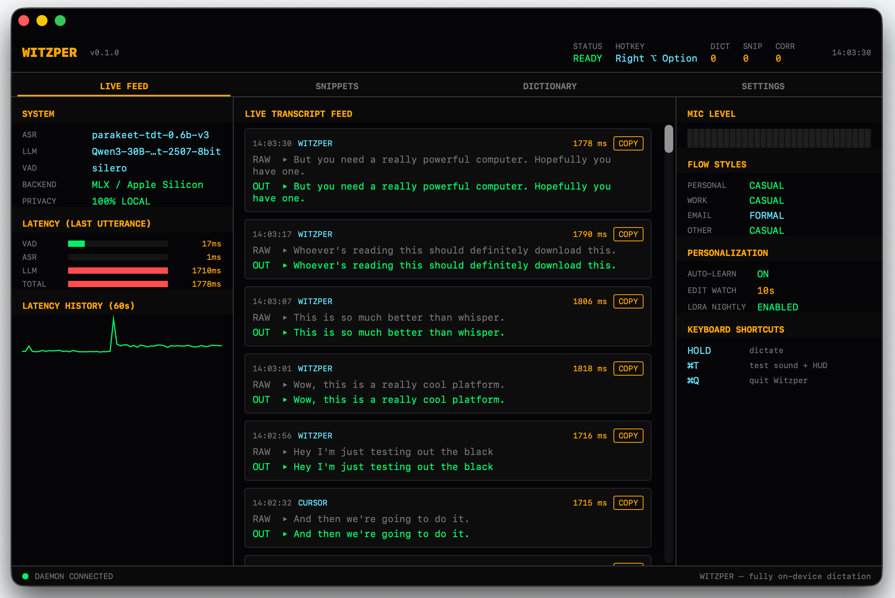

<p align="center">
  
</p>

<h1 align="center">Witzper</h1>

<p align="center">
  <b>Fully local, open-source dictation for macOS Apple Silicon.</b><br/>
  Hold a key, talk, and watch your words land — cleaned up, punctuated, and formatted — in any text field on your Mac.<br/>
  Your audio, transcripts, and corrections <b>never leave your computer</b>.
</p>

<p align="center">
  <sub>Built by <a href="https://ziplyne.agency">Ziplyne</a></sub>
</p>

<p align="center">
  <a href="#-quick-start-non-technical">Quick start</a> ·
  <a href="#-what-makes-witzper-different-from-wispr-flow">vs. Wispr Flow</a> ·
  <a href="#-models">Models</a> ·
  <a href="#-features">Features</a> ·
  <a href="#-troubleshooting">Troubleshooting</a>
</p>

---

## What is Witzper?

Witzper is a macOS app that turns your voice into polished, ready-to-send text. You hold a key (default: **Fn**), speak normally, release the key — and your words appear in whatever you're writing: iMessage, Slack, Gmail, Notion, VS Code, anywhere. Punctuation, capitalization, and tone are handled automatically by a local language model that knows *which app you're writing in* and *how you personally write*.

It's built to match or beat [Wispr Flow](https://wisprflow.ai) on latency and transcript quality — without sending a single byte of your audio to the cloud.

<p align="center">
  
</p>

---

## ⚡ Why Witzper over Wispr Flow?

| | Witzper | Wispr Flow |
|---|---|---|
| **Where your voice goes** | Stays on your Mac. Always. | Cloud (their servers). |
| **Cost** | Free. MIT licensed. | Subscription. |
| **Works offline** | ✅ Yes | ❌ No |
| **Model quality** | 30B-parameter Qwen3 MoE running locally | Proprietary cloud model |
| **Personalization** | Nightly LoRA fine-tune on **your** edits | Global model, tweaks via dictionary only |
| **Swappable models** | ✅ Pick any of 7 cleanup LLMs + 4 ASR models | ❌ Locked |
| **Voice snippets with variables** | ✅ `{date}`, `{time}`, `{cursor}` *(coming)* | Plain snippets only |
| **Telemetry** | None. Ever. | Opt-out analytics |
| **Source code** | Open | Closed |

The cost: you need a recent Apple Silicon Mac with real RAM. The default setup wants **32 GB**. See [system requirements](#-system-requirements).

---

## 🚀 Quick start (non-technical)

> **⚠️ Status:** Witzper is currently a **developer scaffold** — there's no signed `.dmg` installer yet. The steps below work on any Apple Silicon Mac but involve the Terminal. If you can copy-paste four lines, you can run Witzper. A one-click installer is on the roadmap.

### Step 1 — Install the prerequisites (one time, ~5 minutes)

Open the **Terminal** app (⌘-space → type "Terminal" → Enter). Paste each line and press Enter:

```bash
# 1. Install Homebrew (the Mac package manager). Skip if you already have it.
/bin/bash -c "$(curl -fsSL https://raw.githubusercontent.com/Homebrew/install/HEAD/install.sh)"

# 2. Install the three tools Witzper needs.
brew install python@3.13 ffmpeg git

# 3. Install Xcode command-line tools (needed to build the menu-bar helper).
xcode-select --install
```

### Step 2 — Download and build Witzper (~10 minutes)

```bash
git clone https://github.com/isaachorowitz/Witzper.git ~/Witzper
cd ~/Witzper
./scripts/setup.sh
```

This creates a Python virtual environment, installs every Python dependency, and builds the Swift menu-bar helper. Grab a coffee.

### Step 3 — Download the AI models (~40 GB, ~15 minutes on fast internet)

```bash
./scripts/download_models.sh
```

By default this pulls the **Parakeet** speech-recognition model (~1 GB) and the **Qwen3-30B** cleanup model (~32 GB). If you're on a 16 GB Mac, see [System requirements](#-system-requirements) for smaller options you can configure *before* running this.

### Step 4 — Grant permissions

On first launch Witzper will ask for three macOS permissions. All three are required:

1. **Microphone** — to hear you.
2. **Accessibility** — to capture the global hotkey and read the focused text field's context.
3. **Input Monitoring** — same reason, macOS splits this from Accessibility.

For each prompt, macOS will open *System Settings → Privacy & Security*. Flip the toggle next to **Witzper**, then relaunch.

### Step 5 — Run it

```bash
./scripts/run.sh
```

The first time you run this, it'll ask you to pick a push-to-talk hotkey (default **Fn**). Then you'll see the Witzper waveform icon in your menu bar. **Hold Fn**, say *"hey are you free for lunch tomorrow"*, release. It should type back `Hey are you free for lunch tomorrow?` into whatever field you have focused.

That's it. Stop the daemon with **⌃C** in the terminal.

> 💡 **Tip**: Want Witzper to show up as a proper Mac app (so macOS treats it like any other app for permissions)? Run `./scripts/build_app.sh` and drag `build/Witzper.app` to `/Applications`.

---

## 💻 System requirements

Witzper runs real language models in unified memory. How much RAM you have determines which models you can use.

| Your Mac's RAM | Recommended cleanup model | What you get |
|---|---|---|
| **16 GB** | Qwen3 4B (4-bit) or Llama 3.2 3B | Fast, decent quality, 80 ms cleanup |
| **32 GB** | Qwen3 14B (8-bit) | Near-flagship quality, 180 ms cleanup |
| **64 GB+** | **Qwen3 30B-A3B (8-bit)** ← default | Witzper's sweet spot, 250 ms cleanup |

### Hard requirements
- **Mac with Apple Silicon** (M1, M2, M3, M4, M5 — *not* Intel)
- **macOS 14.0 Sonoma** or newer
- **Python 3.11+** (3.13 recommended)
- **ffmpeg** (for audio decoding)
- **Xcode command-line tools** (for building the Swift helper)
- **~40 GB free disk** for the default model set (more if you want Command Mode)
- **Internet for the first run only** (model download). After that: fully offline.

### Steady-state memory use (default config)

| Component | RAM |
|---|---|
| Qwen3-30B-A3B cleanup LLM (8-bit) | ~32 GB |
| Parakeet TDT 0.6B v3 (ASR) | ~1 GB |
| MiniLM few-shot embedder | ~150 MB |
| Silero VAD | ~50 MB |
| Witzper menu-bar app + dashboard | ~80 MB |
| Python daemon overhead | ~3 GB |
| **Total hot path** | **~36 GB** |

### Network

Zero telemetry. Zero cloud calls. The only network activity is the first-run model download from Hugging Face Hub. `[telemetry] enabled = false` is the only supported value.

---

## 🧠 Models

Witzper has **three model roles**: an ASR (speech-to-text), a Cleanup LLM, and an optional Command Mode LLM. Every model is swappable — either by editing `~/.config/Witzper/config.toml` or by using the built-in dashboard picker.

### 1. Cleanup LLM — the hot path

Runs on every utterance. Takes the raw transcript and fixes grammar, punctuation, and applies your per-app Flow Style. Latency matters here.

| Model | Label | RAM | Latency | Quality | Best for |
|---|---|---|---|---|---|
| `juanquivilla/sotto-cleanup-lfm25-350m-mlx-4bit` | Sotto Cleanup 350M | 0.2 GB | ~30 ms | ★★★★ | Any Mac — purpose-built for transcript cleanup |
| `mlx-community/Llama-3.2-1B-Instruct-4bit` | Llama 3.2 1B | 0.7 GB | ~40 ms | ★★★ | Oldest M1 Macs |
| `mlx-community/Llama-3.2-3B-Instruct-4bit` | Llama 3.2 3B | 2 GB | ~70 ms | ★★★ | 8–16 GB Macs |
| `mlx-community/Qwen3-4B-Instruct-2507-4bit` | Qwen3 4B | 2.5 GB | ~80 ms | ★★★★ | **Recommended for 16 GB Macs** |
| `mlx-community/Qwen3-8B-Instruct-2507-4bit` | Qwen3 8B | 5 GB | ~120 ms | ★★★★ | 16–24 GB Macs |
| `mlx-community/Qwen3-14B-Instruct-2507-8bit` | Qwen3 14B | 15 GB | ~180 ms | ★★★★★ | **Recommended for 32 GB Macs** |
| `mlx-community/Qwen3-30B-A3B-Instruct-2507-8bit` | **Qwen3 30B-A3B** *(default)* | 32 GB | ~250 ms | ★★★★★ | **Recommended for 64 GB+ Macs** — 30B MoE with only 3B active params |

### 2. ASR — speech-to-text

| Model | Label | RAM | Latency | Languages | Notes |
|---|---|---|---|---|---|
| `mlx-community/parakeet-tdt-0.6b-v3` | **Parakeet TDT 0.6B v3** *(default)* | 1 GB | ~80 ms | 25 | 10× faster than Whisper Large v3 with lower WER |
| `mlx-community/whisper-large-v3-turbo` | Whisper Large v3 Turbo | 3 GB | ~200 ms | 100+ | Use for languages Parakeet doesn't cover |
| `mlx-community/whisper-large-v3-mlx` | Whisper Large v3 (full) | 6 GB | ~500 ms | 100+ | Highest quality, slowest |
| `mlx-community/whisper-medium-mlx` | Whisper Medium | 1.5 GB | ~250 ms | English-focused | Middle-ground Whisper |
| `mlx-community/Qwen3-ASR` | Qwen3-ASR *(accuracy mode — experimental)* | ~4 GB | 150–300 ms | Multi | Accepts a text context prompt for Wispr-style context-conditioned recognition. **Requires the community MLX port — see [Experimental features](#-experimental--coming-soon).** |

**ASR mode selection** (`[asr] mode` in config):
- `speed` — always Parakeet (no context prompt).
- `accuracy` — always Qwen3-ASR with full context injection.
- `auto` — per-app, driven by `configs/app_rules.toml` (e.g. accuracy in Mail, speed in iMessage).

### 3. Command Mode — lazy-loaded *(experimental)*

A separate hotkey (default `right_cmd+right_option`) triggers Command Mode for transformations like *"rewrite this as an email"*, *"translate to Spanish"*, or *"restructure as bullets"*.

| Model | Label | RAM | Notes |
|---|---|---|---|
| `mlx-community/Qwen3-14B-Instruct-2507-4bit` | Qwen3 14B (light) | 8 GB | For 32 GB Macs |
| `mlx-community/Qwen3-30B-A3B-Instruct-2507-8bit` | **Qwen3 30B-A3B (shared — default)** | 0 GB extra | Reuses the cleanup model already in memory |

> **Note**: Command Mode's inference backend (`flow/models/command.py`) is implemented, but the hotkey wiring is not in this release. See [Experimental features](#-experimental--coming-soon).

### Auxiliary models (always loaded)
- **VAD**: Silero (default, unauthenticated) or `pyannote/segmentation-3.1` (requires HF license accept).
- **Few-shot embedder**: `sentence-transformers/all-MiniLM-L6-v2` — embeds your past corrections so similar ones get retrieved as in-context examples during cleanup.

---

## ✨ Features

### Core dictation
- 🎙 **Push-to-talk dictation** — hold Fn / Right ⌥ / Right ⌘ / Right ⇧ / Caps Lock, speak, release.
- 🧠 **Local LLM cleanup** — 30B-parameter MoE model fixes grammar, punctuation, and disfluencies on every utterance.
- 📡 **Streaming partial transcripts in the HUD** — see your words appear live as you speak, with the exact text the model currently hears.
- ⚡ **Pre-flight ASR** — the speech model processes audio *while you're still talking*, so by the time you release the hotkey the raw transcript is already done. End-to-end latency roughly halved.
- 🎯 **Context-aware ASR** *(accuracy mode)* — the model is given your focused app, window title, surrounding text, and personal vocabulary so it nails proper nouns.
- 🔀 **Auto mode switching** — Witzper picks speed (Parakeet) or accuracy (Qwen3-ASR) per-app via `configs/app_rules.toml`.
- 🛡 **Hallucination guardrail** — if the cleanup LLM produces output that's too long or too different from the raw transcript, Witzper falls back to the raw text.
- 📋 **Smart insertion** — clipboard-paste in normal apps, synthesized keystrokes for terminals and password fields. Clipboard contents are restored after insertion.

### Personalization (the moat over Wispr Flow)
- 📖 **Personal dictionary** — names, acronyms, jargon. Boosts ASR accuracy and powers deterministic `wrong → right` replacements.
- 🪄 **Voice snippets** — say *"my address"*, get `123 Main St`. Case-insensitive whole-word matching.
- 🎨 **Flow Styles per app category** — Casual / Formal / Very Casual / Excited, mapped independently to Personal Messages / Work Messages / Email / Other.
- 👀 **Edit watcher** — Witzper watches the focused field for 10 s after inserting text. Any edit you make becomes a training pair for your personal LoRA.
- 🔁 **Few-shot retrieval** — MiniLM embeds the current transcript, pulls the top-5 most similar past corrections, feeds them to the cleanup LLM as in-context examples. Quality improves from day one with zero training.
- 🌙 **Nightly cleanup LoRA** — `mlx-lm` trains a rank-16 LoRA over your `(raw → cleaned)` pairs while you sleep. Adapters hot-swap without reloading the base model. Cron: `0 3 * * *`.
- 🎤 **Biweekly ASR LoRA** *(scaffolded)* — rank-8 LoRA over `(audio → transcript)` pairs. Cron: `0 4 */14 * *`.
- 📊 **Automatic dictionary learning** — single-token edits within edit distance 2 append to your boost dictionary automatically.

### Dashboard (`Witzper.app`)
Open via the menu-bar icon or `flow doctor`. Tabs:
- **Live** — real-time transcript stream with per-stage latency (VAD / ASR / LLM / total).
- **Dictionary** — add, remove, browse boost words and replacement rules.
- **Snippets** — manage voice-snippet expansions.
- **Settings** — swap models (cleanup / ASR / command) from the catalog, pick your hotkey, choose a microphone, set Flow Styles.

### UI niceties
- 🔴 **Floating HUD pill** — pulsing red dot + status + live partial transcript, always on top, works across Spaces.
- 🔕 **Menu-bar icon** — waveform glyph that highlights while recording.
- 🔊 **Audio feedback** — start/stop tones (configurable).
- ✅ **Built-in diagnostics** — `flow doctor` and the menu's "Show diagnostics…" dialog check permissions, models, and sockets.

### Privacy
- **No telemetry, ever.** The `[telemetry] enabled = false` knob is hardcoded to false.
- **All state local**: `~/.local/share/Witzper/` (SQLite + audio), `~/.config/Witzper/config.toml` (settings), `~/.cache/huggingface/hub/` (model weights).
- **IPC sockets** (`/tmp/Witzper.sock`, `/tmp/flow-context.sock`, `/tmp/flow-stream.sock`) are Unix-domain, mode 0600.

---

## 🛠 Command-line reference

After `./scripts/setup.sh`, the `flow` command lives inside `.venv`:

```bash
source .venv/bin/activate  # or let run.sh do this for you
```

| Command | What it does |
|---|---|
| `flow run [-v]` | Start the dictation daemon. `-v` prints per-stage latency for every utterance. |
| `flow setup` | Interactive hotkey picker (first-run wizard). |
| `flow doctor` | Check models, permissions, Swift helper, audio devices. |
| `flow dict --add <word>` | Add a vocabulary boost word. |
| `flow dict --replace 'wrong=right'` | Add a deterministic replacement rule. |
| `flow dict --remove <term>` | Remove a boost word or replacement. |
| `flow dict --list` | Show the full dictionary. |
| `flow snippet --add '<trigger>' --text '<expansion>'` | Add a voice snippet. |
| `flow snippet --remove '<trigger>'` | Remove a snippet. |
| `flow snippet --list` | Show all snippets. |
| `flow style` | Show current Flow Styles per app category. |
| `flow style <category> <name>` | Set a style. Categories: `personal_messages`, `work_messages`, `email`, `other`. Styles: `formal`, `casual`, `very_casual`, `excited`. |
| `flow train cleanup` | Manually run a LoRA fine-tune of the cleanup LLM. Needs ≥20 correction pairs. |
| `flow train asr` | Export an ASR-training manifest (experimental). |

---

## ⚙️ Configuration

Defaults live in [`configs/default.toml`](configs/default.toml). To override anything, create `~/.config/Witzper/config.toml` with only the keys you want to change.

```toml
[hotkey]
key = "fn"                # "fn" | "right_option" | "right_cmd" | "right_shift" | "caps_lock"
toggle_mode = false

[audio]
sample_rate = 16000
channels = 1
device = "default"        # or an exact mic name from "Show diagnostics…"
max_seconds = 120

[vad]
backend = "silero"        # "silero" | "pyannote"
endpoint_silence_ms = 700

[asr]
mode = "auto"             # "speed" | "accuracy" | "auto"
streaming = true          # live partial transcripts in HUD (IDEAS #1)
streaming_interval_ms = 350
streaming_min_audio_ms = 350
streaming_reuse_ratio = 0.95   # reuse partial instead of re-transcribing on key-up (IDEAS #2)

[asr.speed]
model = "mlx-community/parakeet-tdt-0.6b-v3"
backend = "parakeet-mlx"

[asr.accuracy]
model = "mlx-community/Qwen3-ASR"
backend = "qwen3-asr-mlx"
context_prompt_max_tokens = 1024

[cleanup]
model = "mlx-community/Qwen3-30B-A3B-Instruct-2507-8bit"
max_tokens = 96
temperature = 0.0
few_shot_n = 5
max_length_ratio = 1.8
max_edit_distance_ratio = 0.5

[command]
enabled = true
model = "mlx-community/Qwen3-30B-A3B-Instruct-2507-8bit"
max_tokens = 2048
hotkey = "right_cmd+right_option"

[insertion]
default_strategy = "paste"          # "paste" | "type"
restore_clipboard_after_ms = 200

[personalization]
auto_add_to_dictionary = true
edit_watch_window_seconds = 10
cleanup_lora_enabled = true
cleanup_lora_rank = 16
cleanup_lora_schedule_cron = "0 3 * * *"
asr_lora_enabled = true
asr_lora_rank = 8
asr_lora_schedule_cron = "0 4 */14 * *"
dspy_enabled = true

[styles]
personal_messages = "casual"
work_messages = "casual"
email = "casual"
other = "casual"

[snippets]
case_insensitive = true
strip_trailing_punct_on_solo_trigger = true

[telemetry]
enabled = false                     # do not change
```

---

## 🏗 Architecture

```
Hotkey (Swift CGEventTap)
        │
        ▼
Audio capture (16 kHz mono)
        │
        ▼
Streaming partial loop ◄── feeds HUD live ──► HUD (Swift, floating pill)
        │
        ▼
VAD (Silero) — endpoint trim
        │
        ▼
ASR (Parakeet / Qwen3-ASR / Whisper)
   ▲         ▲
   │         └── AX context (app, window, surrounding text)
   └── personal dictionary boost terms
        │
        ▼
Few-shot retriever (MiniLM + SQLite)
        │
        ▼
Cleanup LLM (Qwen3-30B-A3B MoE via MLX)
   + Flow Style instruction per app category
   + top-5 few-shots
   + alt-hypothesis rerank
        │
        ▼
Hallucination guardrail (fall back to raw if exceeded)
        │
        ▼
Dictionary replace → Snippet expansion
        │
        ▼
Inserter (clipboard paste or keystroke)
        │
        ▼
Edit watcher (captures corrections → nightly LoRA)
```

See [`docs/architecture.md`](docs/architecture.md) for the full walkthrough.

---

## 🎯 Target performance (M-series Max, 64 GB)

| Mode | Components | End-to-end p50 |
|---|---|---|
| Speed | Parakeet + Qwen3-30B-A3B | 200–350 ms |
| Accuracy | Qwen3-ASR + Qwen3-30B-A3B | 350–600 ms |
| Command Mode | Qwen3-30B-A3B (shared) | 800 ms–2 s |

Per-stage budget:

| Stage | Target |
|---|---|
| VAD endpoint trim | ≤ 30 ms |
| Parakeet ASR | 40–80 ms |
| Qwen3-ASR | 150–300 ms |
| Cleanup LLM (Qwen3-30B) | 150–250 ms |
| Insertion | ≤ 10 ms |

With streaming + pre-flight ASR (IDEAS #1 + #2), the **perceived** latency is closer to *(cleanup LLM) + (insertion)* because the ASR work overlaps with speech.

---

## 🧪 Experimental / coming soon

These features live in the codebase but are not fully wired in the current release. Clearly marked so nobody gets surprised:

- **Qwen3-ASR accuracy mode** — the wrapper (`flow/models/qwen3_asr.py`) is ready, but the community `qwen3-asr-mlx` package is still stabilizing. Until it's on PyPI, Witzper falls back to Parakeet and ignores `asr.mode = "accuracy"`. Track progress in [IDEAS.md](IDEAS.md).
- **Command Mode hotkey** — `flow/models/command.py` can run transformations using the shared cleanup model, but the second-hotkey listener that feeds it *"rewrite this email"* style instructions isn't wired yet. Planned as IDEAS #5.
- **ASR LoRA training** — `flow train asr` exports a manifest for the Qwen3-ASR MLX trainer; actual training integration is pending that same port.
- **DSPy prompt optimization** — dependency is installed under `[personalize]` extras, runner is not yet invoked from cron.
- **Signed DMG installer** — everything is currently source-installed. A signed `.app` bundle build lives at `scripts/build_app.sh` for personal use.

See [`IDEAS.md`](IDEAS.md) for the full backlog with priorities.

---

## 🆘 Troubleshooting

### "The hotkey does nothing"
You're missing Accessibility and/or Input Monitoring permission. Click the Witzper menu-bar icon → *Open Accessibility Settings…*, flip Witzper on, then *Open Input Monitoring Settings…* and do the same. **You must quit and relaunch Witzper after granting permissions** — macOS caches the old state.

### "No such command: flow"
You didn't activate the venv. Run `source .venv/bin/activate` from the repo root, then try again. Or just use `./scripts/run.sh` which activates it for you.

### "Witzper daemon already running (pid 1234)"
A stale daemon. Kill it with `kill 1234` (use the pid shown) or `pkill -f 'python -u -m flow run'`.

### "Out of memory" / Mac is swapping
Your cleanup model is too big for your RAM. Open `~/.config/Witzper/config.toml` and swap to a smaller model from [the catalog](#1-cleanup-llm--the-hot-path), e.g.:
```toml
[cleanup]
model = "mlx-community/Qwen3-4B-Instruct-2507-4bit"
```
Then re-run `./scripts/download_models.sh` (it'll skip what you already have).

### "Models download fails / HuggingFace 401"
For pyannote VAD you need an HF account and to accept the license on the model page. Witzper silently falls back to Silero if pyannote auth fails, so this is optional. For the Qwen models no auth is needed — they're on `mlx-community`.

### "Swift helper not built"
Run `(cd swift-helper && swift build -c release)`. You'll need Xcode command-line tools (`xcode-select --install`).

### Built-in diagnostics
```bash
flow doctor
```
Or click the menu-bar icon → *Show diagnostics…*

---

## 🗂 Repo layout

```
Witzper/
├── flow/                         # Python inference daemon
│   ├── __main__.py               # `flow` CLI
│   ├── config.py                 # TOML + pydantic
│   ├── core/                     # orchestrator, audio, VAD, hotkey, doctor, setup wizard
│   ├── models/                   # ASR (Parakeet, Whisper, Qwen3-ASR) + cleanup + command LLMs
│   ├── context/                  # app context, dictionary, few-shot retriever, styles
│   ├── insert/                   # clipboard + keystroke inserter
│   ├── personalize/              # correction store, edit-watch, snippets, LoRA trainer
│   └── ui/                       # HUD pill + event stream
├── swift-helper/                 # Menu-bar app, HUD, dashboard
│   └── Sources/FlowHelper/
│       ├── main.swift            # CGEventTap, menu bar, Unix sockets, stream listener
│       ├── HUD.swift             # floating pill w/ live partial transcript
│       ├── Dashboard.swift       # SwiftUI Live / Dict / Snippets / Settings
│       ├── ModelCatalog.swift    # the swappable model list
│       ├── ModelPickerView.swift, SettingsView.swift, DictionaryView.swift, SnippetsView.swift
│       ├── Inserter.swift, SQLiteStore.swift, Sounds.swift
├── configs/
│   ├── default.toml              # all defaults
│   ├── app_categories.toml       # app → Flow Style category rules
│   └── app_rules.toml            # app → ASR mode rules (auto)
├── scripts/
│   ├── setup.sh                  # venv + deps + Swift build
│   ├── download_models.sh        # HF prefetch
│   ├── run.sh                    # launch helper + daemon
│   ├── build_app.sh              # package Witzper.app
│   ├── build_icon.py             # .icns generator
│   ├── test_pipeline.py          # end-to-end smoke test
│   └── train_nightly.sh          # cron entry for LoRA training
├── docs/architecture.md
├── assets/                       # app icon + iconset
├── IDEAS.md                      # feature backlog
├── TODO.md                       # build-out order
├── README.md
└── LICENSE                       # MIT
```

---

## 🤝 Contributing

Witzper is MIT-licensed and contributions are welcome. Good starter tasks are tagged in [`IDEAS.md`](IDEAS.md) — especially the ones flagged "High-impact, low effort". Open a PR or issue on GitHub.

Run the smoke test before submitting:
```bash
python scripts/test_pipeline.py
```

---

## 📜 License

MIT © 2026 Isaac Horowitz. See [`LICENSE`](LICENSE).

Built by [Ziplyne](https://ziplyne.agency).

Built with [MLX](https://github.com/ml-explore/mlx), [parakeet-mlx](https://github.com/senstella/parakeet-mlx), [mlx-lm](https://github.com/ml-explore/mlx-examples/tree/main/llms), [sentence-transformers](https://www.sbert.net/), [Silero VAD](https://github.com/snakers4/silero-vad), and [pyannote.audio](https://github.com/pyannote/pyannote-audio). Witzper would not exist without any of them.

Model weights are downloaded on demand from each upstream author. Please review and comply with each model's license before redistribution:

| Model | Upstream | License |
| :---- | :------- | :------ |
| Qwen3 family (4B / 8B / 14B / 30B-A3B) | [Qwen team](https://github.com/QwenLM/Qwen3) | [Apache 2.0 / Qwen Research License](https://huggingface.co/Qwen/Qwen3-30B-A3B-Instruct-2507/blob/main/LICENSE) |
| Parakeet TDT 0.6B v3 | [NVIDIA NeMo](https://github.com/NVIDIA/NeMo) | [CC BY 4.0](https://huggingface.co/nvidia/parakeet-tdt-0.6b-v3) |
| Whisper Large v3 / Turbo | [OpenAI](https://github.com/openai/whisper) | [MIT](https://github.com/openai/whisper/blob/main/LICENSE) |
| Silero VAD | [snakers4](https://github.com/snakers4/silero-vad) | [MIT](https://github.com/snakers4/silero-vad/blob/master/LICENSE) |
| pyannote segmentation 3.1 | [pyannote](https://huggingface.co/pyannote/segmentation-3.1) | [MIT, gated](https://huggingface.co/pyannote/segmentation-3.1) — requires HF auth + license accept |
| MLX quantizations | [mlx-community](https://huggingface.co/mlx-community) | Inherit upstream |
